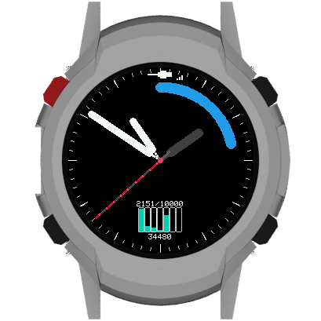
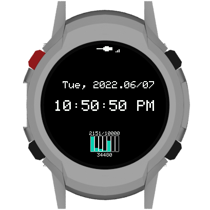
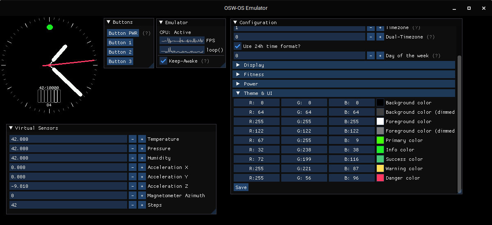

# HowTo Run

**Please read the documentation on the [website](https://open-smartwatch.github.io/)!**

## Prerequirements

1. Install [PlatformIO Core](https://docs.platformio.org/en/latest/core/installation.html) or [PlatformIO IDE](https://docs.platformio.org/en/latest/integration/ide/vscode.html#ide-vscode) (which installs PlatformIO core automatically), as well as the packages specified in `scripts/requirements.txt` (e.g. `pip install -r scripts/requirements.txt`).
2. **For LUA-scripting support (see env:LIGHT_EDITION_DEV_LUA)**: Install [SWIG](http://www.swig.org/Doc4.0/SWIGDocumentation.html#Preface_installation) (also available in most package managers, e.g. `brew install swig` or `apt install swig`)
3. **As this repository contains binary data (e.g. schematics or images), make sure to have `git-lfs` installed!** Cloning this repository without `git-lfs` will result in missing or broken files.
4. Then clone this repository:
    ```bash
    $ git clone --recurse-submodules https://github.com/Open-Smartwatch/open-smartwatch-os.git
    ```
5. To update the sources / packages later on, run:
    ```bash
    # pull new changes and update submodules
    $ git pull
    $ git submodule sync # make sure to propagate origin-changes
    $ git submodule update --init --recursive # update / create theis commits
    # update the PlatformIO packages
    $ pio pkg update # use the small terminal-icon in the bottom left corner of VSCode
    ```

## Build
<p align="center">
  <a href="https://github.com/Open-Smartwatch/open-smartwatch-os/actions/workflows/test-OSW.yml"></a>
  <a href="https://github.com/Open-Smartwatch/open-smartwatch-os/actions/workflows/test-EMULATOR.yml"></a>
  <a href="https://github.com/Open-Smartwatch/open-smartwatch-os/actions/workflows/test-FEATURE.yml"></a>
  <a href="https://github.com/Open-Smartwatch/open-smartwatch-os/actions/workflows/test-OS.yml"></a>
  <a href="https://github.com/Open-Smartwatch/open-smartwatch-os/actions/workflows/astyle.yml"></a>
</p>

The `master` branch is a stable version and the `develop` branch is our beta version. Recommended is, that you upload the `master` branch - except if you want to help us by testing the next release or need (very) new features 😉.

### Visual Studio Code

Open the cloned repo in VSCode:

```bash
$ code open-smartwatch-os
```

You may rename the file `include/config.h.example` to `include/config.h` and adapt the values according to your requirements. That config is *only applied once* after you wiped the flash of the watch or changed the config-version number in `osw_config.h` (...).

### CLI

Alternatively, you can go to the repo folder with your terminal and run...

```bash
$ pio run -t upload
```

If you want to compile for a specific model, you can use the `-e` flag with an `env` name from the `platformio.ini` file.

## Hack it!
To get started, take a look into the examples in the `src/apps/examples` folder - or just into any other app. If you want to compile the examples or other (by default) excluded applications, take a look into the `main.cpp` file and add the respective flags to the `platformio.ini` file.

## CLI

If you want to print out the log for debugging (also including decoded exception traces), use the following command:

```bash
$ pio device monitor
```

In this serial console you also have the ability (beside much more) to configure the watch - just type in `help` to get started:
```
OSW > help
Available commands:
  configure - enter configuration mode
  help      - show this help
  hostname  - show the device hostname
  lock      - lock the console
  reboot    - warm-start the device forcefully
  time      - show current UTC time
  wipe      - format NVS partition and reset configuration
```

## Creating Screenshots of your Apps

<p align="center">
    
    
</p>

* Wi-Fi needs to be able to connect for this to work.
* You will need bash and ImageMagick for the helper scripts to work
* You'll need to enable the respective feature flag to enable it (see below)

The raw screenserver runs in the background and should report via serial:
```
Started RAW ScreenServer under http://.../api/screenserver
```

### HowTo

 * Add `-D RAW_SCREEN_SERVER` to your build flags in `platformio.ini`
 * Build + Flash + Reboot the watch
 * Connect + wait for the server to be started (see msg above)
 * Run `bash fetchScreen.sh <IP_OF_WATCH> screenshot.png`
 * Run `bash composeScreen.sh screenshot.png screenshot_composed.png`

If there is no `curl`, it must be installed.
```bash
$ apt install curl -y
```
The `fetchScreen.sh` downloads the raw image buffer from the running screen server, and converts the image to png. The `composeScreen.sh` creates the image with a surrounding smartwatch "overlay" (light edition).

#### The fast way (recommended)

Run the following inside the `open-smartwatch-os` directory:

```bash
$ cd scripts/screen_capture/
$ ./createScreenshot.sh <IP_OF_WATCH> <SCREENSHOT>
```
* The captured file can be found in the `screenshot/` folder inside the `open-smartwatch-os` directory.

## Troubleshooting

For more information on troubleshooting, see [Wiki](https://open-smartwatch.github.io/resources/firmware/#troubleshooting).

### Arduino_TFT.h: No such file or directory

You did not clone the repository with the `--recursive-submodules` flag.

### Failed to connect to ESP32: Timed out waiting for packet header

You did not hold down BTN1(FLASH) and then tap the RESET button on the watch whilst platform.io was trying to connect.

## OSW Emulator


The OS itself can be executed as a regular program on your machine. This saves you time compiling for the watch and flashing the OS, every time you make a minor change - e.g. while developing the UI or a game, which not explicitly depend on the hardware of the watch.

This also implies some limitations what you can do with the emulator, as we had to hack and reimplement some of the Arduino-specific libraries and their (conflicting) simplifications. This also means, that it maybe necessary to extend those extensions down the road as we (likely) missed that one specific function you try to use... 😉

### Build (cmake)
The emulator can be build using the `CMakeLists.txt` file - you may need to install additional libraries to be able to use it.

Here is a small example running on "Ubuntu 22.04 LTS":
```bash
$ sudo apt install libsdl2-dev libsdl2-image-dev g++ gcc cmake make build-essential
$ mkdir build && cd build
$ cmake ..
$ make -j $(nproc)
$ ./emulator.run
```

You also may extend the `cmake`-command with `-DCMAKE_BUILD_TYPE=Release` to get an even faster and smaller binary.

#### Debugging with VSCode

Take alook into the `.vscode` folder - there should be a `launch.json.sample` file. Copy it to `launch.json` and adjust the paths (if you are using Windows) to your needs. Then you can start debugging the emulator with VSCode via "Run and Debug".

### With Docker
If a library is unavailable, you can still use the emulator using docker (e.g. on Ubuntu 20.04 SDL2 is too old). Proceed with a typical docker installation. Showing an application running in docker requires some additional steps:

#### Host PC
*Tested on Ubuntu 20.04.*
```bash
$ xhost +
$ xauth list # Copy the result of the command. 
$ docker run --net=host -e DISPLAY -v /tmp/.X11-unix -d --name OSW -p 22:22 -it --privileged ubuntu:22.04
```

#### Docker
```bash
$ xauth add <'xauth list' command result>
```

## Testing
After making some changes to the code, you should test the application by running our unit and UI tests. 

Note: our tests do not cover 100% of the application. If you want to see which parts are covered by tests take a look at `emulator/src/unitTests` and `emulator/src/uiTests`.

### Unit tests
Run all unit tests:
```bash
$ ./emulator.run --unit_tests
``` 
List all unit tests, one per line:
```bash
$ ./emulator.run --list_tests
```

### UI tests
Run the emulator with UI tests window:
```bash
$ ./emulator.run --ui_tests
```

***IMPORTANT**: If you add some new features, it is strongly recommended to write unit and UI tests for them.*

## License
Everything in this repository is under a GPL-3.0 license, see [here](./LICENSE) for more details.
