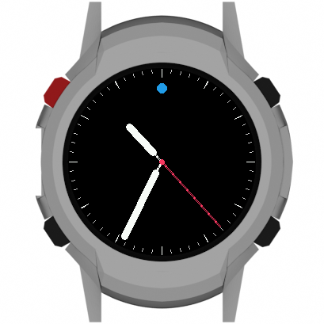
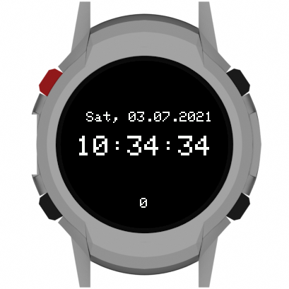

# HowTo Run

**Please read the documentation on the [website](https://open-smartwatch.github.io/resources/firmware/)!**

## Prerequirements

* install [Platformio Core](https://docs.platformio.org/en/latest/core/installation.html) or [Platformio IDE](https://docs.platformio.org/en/latest/integration/ide/vscode.html#ide-vscode) (which installes Pio core automatically)
* **For improved LUA Script support, see env:pico32_LIGHT_EDITION_PREBUILD_LUA**: install [SWIG](http://www.swig.org/Doc4.0/SWIGDocumentation.html#Preface_installation) (also available in most package managers, e.g. `brew install swig`)
* Then clone this repository

```
git clone --recurse-submodules https://github.com/Open-Smartwatch/open-smartwatch-os.git
```

## build (Visual Studio Code)

Open the cloned repo in VSCode

```
code open-smartwatch-os
```

and rename file `include/config.h.example` to `include/config.h` and adapt the values according to your requirements and press f5 to build it.

## build (CLI)

You can instead go to the repo folder with your terminal and run

```
pio run -e pico32_LIGHT_EDITION -t upload
```

respectively

```
pio run -e pico32_GPS_EDITION -t upload
```

depending on the watch model.

## Creating Screen Shots of your Apps




* Wifi needs to be able to connect for this to work.
* you will need bash and imagemagick for the helper scripts to work

The raw screenserver runs in the background and prints via serial:

```
Started Raw ScreenServer
http://<IP_OF_WATCH>:8080/screen.raw
```

### HowTo

 * add `-D RAW_SCREEN_SERVER` to your build flags in `platformio.ini``
 * build + flash + reset watch
 * wait for the server to be started (see msg above)
 * run `bash fetchScreen.sh <IP_OF_WATCH> screenshot.png`
 * run `bash composeScreen.sh screenshot.png screenshot_composed.png`

The `fetchScreen.sh` downloads the raw image buffer from the running screen server, and converts the image to png. The `composeScreen.sh` creates the image with a surrounding smartwatch (light edition).

## Troubleshooting
### Arduino_TFT.h: No such file or directory

You did not clone the repository with the `--recursive-submodules` flag.

### 'LANG_STW_START' was not declared in this scope

You did not rename `include/config.h.example`

### Failed to connect to ESP32: Timed out waiting for packet header

You did not hold down BTN1(FLASH) and then tap the RESET button on the watch whilst platform.io was trying to connect.

## OSW Emulator


The OS itself can be executed as a regular program on your machine. This saves you time compiling for the watch and flashing the OS, every time you make a minor change - e.g. while developing the UI or a game, which not explicitly depend on the hardware of the watch.

This also implies some limitations what you can do with the emulator, as we had to hack and reimplement some of the Arduino-specific libraries and their (conflicting) simplifications. This also means, that it maybe necessary to extend those extensions down the road as we (likely) missed that one specific function you try to use... :wink:

### Build (cmake)
The emulator can be build using the `CMakeLists.txt` file - you may need to install additional libraries to be able to use it.

Here is a small example running on "Ubuntu 22.04 LTS":
```bash
sudo apt install libsdl2-dev libsdl2-image-dev g++ gcc make build
cd build
cmake ..
make -j $(nproc)
./emulator.run
```

You also may extend the `cmake`-command with `-DCMAKE_BUILD_TYPE=Release` to get an even faster and smaller binary.