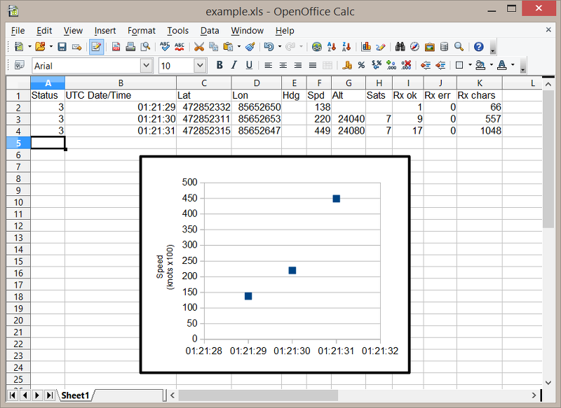

Installing
==========

1. [Download the library](#1-download-the-library)
2. [Choose a serial port](#2-choose-a-serial-port)
3. [Connect the GPS device](#3-connect-the-gps-device)
4. [Review `GPSport.h`](#4-review-librariesneogpssrcgpsporth)
5. [Open the example](#5--open-the-example-sketch-nmeaino)
6. [Build and upload](#6--build-and-upload-the-sketch-to-your-arduino)
<hr>

### 1. Download the library

It is easiest to use the [Ardino IDE Library Manager](https://www.arduino.cc/en/Guide/Libraries#toc3) to automatically download and install NeoGPS.  Select the menu **Sketch -> Include Library -> Manage Libraries**.  Then type "NeoGPS" in the Search box.

If you need to perform a manual installation,:

* Download the [master ZIP file](https://github.com/SlashDevin/NeoGPS/archive/master.zip).
*  Open the zip file and open the nested `NeoGPS-master` subdirectory.
*  Select and copy all files in the `NeoGPS-master` subdirectory into a new `Arduino/Libraries/NeoGPS` directory, like most libraries.  The `Arduino/Libraries/NeoGPS` directory should contain:<br>
```
extras
examples
src
library.properties
LICENSE
README.md
```

<hr>

### 2. Choose a serial port

**BEST**: The fastest, most reliable way to connect a GPS device is to use a HardwareSerial port.

On any Arduino board, you can connect the GPS device to the `Serial` pins (0 & 1).  You can still print debug statements, and they will show up on the Serial Monitor window.  The received GPS characters will not interfere with those prints, and you will not see those characters on the Serial Monitor window.

However, when you need to upload a new sketch to the Arduino over USB, **you must disconnect the GPS TX from the Arduino RX pin 0.**  Otherwise, the GPS characters will interfere with the upload data.  Some people put a switch in that connection to make it easy to upload without disturbing the wires.

For Mega, Due and Teensy boards, you can connect the GPS device to the `Serial1`,  `Serial2` or `Serial3` pins.

For Micro and Leo (and other 32U4-based Arduinos), you can connect the GPS device to the `Serial1` pins.

**2nd Best**:  If you can't connect the GPS device to a `HardwareSerial` port, you should download and install the [AltSoftSerial](https://github.com/PaulStoffregen/AltSoftSerial) or [NeoICSerial](https://github.com/SlashDevin/NeoICSerial) library.  These libraries only work on two specific pins (8 & 9 on an UNO).  This library is very efficient and reliable.  It uses one of the hardware TIMERs, so it may conflict with libraries that use TIMERs or PWM output (e.g., servo).

**3rd Best**:  If you can't use the pins required by `AltSoftSerial`, and your GPS device runs at 9600, 19200 or 38400 baud, you should download and install the [NeoSWSerial](https://github.com/SlashDevin/NeoSWSerial) library.  This library is almost as efficient.  It will help you avoid common timing problems caused by `SoftwareSerial`.  It does not need an extra TIMER, so it can be used with most other libraries.  It does use Pin Change Interrupts, but there is an option in the header file that allows you to coordinate other PCI usage with `NeoSWSerial`.

`NeoSWSerial` can be used with `AltSoftSerial` at the same time, allowing your sketch to have two extra serial ports.

**WORST**:  `SoftwareSerial` is NOT RECOMMENDED, because it disables interrupts for long periods of time.  This can interfere with other parts of your sketch, or with other libraries.  It cannot transmit and receive at the same time, and your sketch can only receive from one `SoftwareSerial` instance at time.

<hr>

### 3. Connect the GPS device

Most GPS devices are 3.3V devices, and most Arduinos are 5V devices.  Although many GPS modules are described as "3V & 5V compatible", 

<p align=center><b>YOU SHOULD NOT CONNECT A 5V ARDUINO TRANSMIT PIN TO THE 3.3V GPS RX PIN</b></p>

This can damage the device, cause overheating, system power problems or decrease the lifetime of battery-operated systems.  You must level-shift this connection with inexpensive level-shifting modules (best) or a resistor divider.

Connecting the 3.3V GPS TX pin to a 5V Arduino receive pin will not damage the GPS device, but it may not be reliable.  This is because the GPS TX voltage is slightly lower than what the Arduino requires.  It works in many situations, but if you are not able to receive GPS characters reliably, you probably need to use a level-shifting module (best) or a diode+resistor to "pull up" the GPS TX pin voltage.

<hr>

### 4. Review `Libraries/NeoGPS/src/GPSport.h`

This file declares a the serial port to be used for the GPS device.  You can either:

* Use the default `GPSport.h` and connect your GPS device according to what it chooses; or
* Replace the entire contents of `GPSport.h` and insert your own declarations (see below and comments in `GPSport.h`).

#### Default choices for GPSport.h

By default, Mega, Leonardo, Due, Zero/MKR1000 and Teensy boards will use `Serial1`.

All other Boards will use [AltSoftSerial](https://github.com/PaulStoffregen/AltSoftSerial) on two specific pins (see table at linked page).

If you want to use a different serial port library (review step 2 above), you must edit these `#include` lines in `GPSport.h`:

```
  //#include <NeoHWSerial.h>    // NeoSerial or NeoSerial1 for INTERRUPT_PROCESSING
  #include <AltSoftSerial.h>    // <-- DEFAULT.  Two specific pins required (see docs)
  //#include <NeoICSerial.h>    // AltSoftSerial with Interrupt-style processing
  //#include <NeoSWSerial.h>    // Any pins, only @ 9600, 19200 or 38400 baud
  //#include <SoftwareSerial.h> // NOT RECOMMENDED!
```

Uncomment **one** of those include statements, and it will use that library for the GPS serial port.

If you uncomment the `NeoSWSerial.h` include, pins 3 and 4 will be used for the GPS.  If your GPS is on different pins, you must edit these `#define` lines in `GPSport.h`:

    #define RX_PIN 4
    #define TX_PIN 3


#### Choosing your own serial port

If you know what serial port you want to use, you can **REPLACE EVERYTHING** in `GPSport.h' with the three declarations that are used by all example programs: 

1. the `gpsPort` variable **(include its library header if needed)**;
2. the double-quoted C string for the `GPS_PORT_NAME` (displayed by all example programs); and
3. the `DEBUG_PORT` to use for Serial Monitor print messages (usually `Serial`).

All the example programs can use any of the following serial port types:

* HardwareSerial (built-in `Serial`, `Serial1` et al. STRONGLY recommended)
* [AltSoftSerial](https://github.com/PaulStoffregen/AltSoftSerial) **DEFAULT** (only works on one specific Input Capture pin)
* [NeoICSerial](https://github.com/SlashDevin/NeoICSerial) (only works on one specific Input Capture pin)
* [NeoHWSerial](https://github.com/SlashDevin/NeoHWSerial) (required for NMEA_isr and NMEASDlog on built-in serial ports)
* [NeoSWSerial](https://github.com/SlashDevin/NeoSWSerial) (works on most pins)
* SoftwareSerial (built-in, NOT recommended)

Be sure to download the library you have selected (NOTE: `HardwareSerial` and `SoftwareSerial` are pre-installed by the Arduino IDE and do not need to be downloaded).

For example, to make all examples use `Serial` for the GPS port **and** for Serial Monitor messages, `GPSport.h` should contain just these 3 declarations:

```
#ifndef GPSport_h
#define GPSport_h

#define gpsPort Serial
#define GPS_PORT_NAME "Serial"
#define DEBUG_PORT Serial

#endif
```

Or, to make all examples use `AltSoftSerial` for the GPS port and `Serial` for Serial Monitor messages, `GPSport.h` should contain just these statements:

```
#ifndef GPSport_h
#define GPSport_h

#include <AltSoftSerial.h>
AltSoftSerial gpsPort;
#define GPS_PORT_NAME "AltSoftSerial"
#define DEBUG_PORT Serial

#endif
```

<hr>

### 5.  Open the example sketch NMEA.ino

In the Arduino IDE, select **File -> Examples -> NeoGPS -> NMEA**.

<hr>

### 6.  Build and upload the sketch to your Arduino.

**Note:**  If the sketch does not compile, please see the [Troubleshooting](Troubleshooting.md#configuration-errors) section.

When the sketch begins, you should see this:
```
NMEA.INO: started
  fix object size = 31
  gps object size = 84
Looking for GPS device on Serial1

GPS quiet time is assumed to begin after a RMC sentence is received.
  You should confirm this with NMEAorder.ino

Status,UTC Date/Time,Lat,Lon,Hdg,Spd,Alt,Sats,Rx ok,Rx err,Rx chars,
3,2016-05-24 01:21:29.00,472852332,85652650,,138,,,1,0,66,
3,2016-05-24 01:21:30.00,472852311,85652653,,220,24040,7,9,0,557,
3,2016-05-24 01:21:31.00,472852315,85652647,,449,24080,7,17,0,1048,
  etc.
```
The default NeoGPS configuration is **Nominal**, as described [here](Configurations.md#typical-configurations).  If you do not see this output, please review the  [Troubleshooting](Troubleshooting.md#gps-device-connection-problems) section.

This output can be copy & pasted into a into a text editor for saving as a CSV file, which can then be imported into a spreadsheet program for graphing or analysis.



<hr>

### The NMEA.ino example works!
Once you have verified the GPS device connection and build process with this first example, you should also verify your device's behavior with `NMEAorder.ino` (see [this section](Troubleshooting.md#quiet-time-interval)).  This can avoid problems later on, when you start adding/merging other functions to do your "work".

[Other examples](Examples.md) include `NMEAloc.ino`, which shows how to use just the location fields of a fix, or `NMEAtimezone.ino`, which shows how to adjust the GPS time for your local time zone.

If you are logging information to an SD card, you should next try `NMEA_isr.ino`.  It is identical to `NMEA.ino`, except that it handles the GPS characters during the RX char interrupt.  Interrupt handling will require one of the NeoXXSerial libraries to be installed (e.g. [NeoHWSerial](https://github.com/SlashDevin/NeoHWSerial)).

If you are working on a drone or other autonomous system, you should read about [Coherency](Coherency.md) and the interrupt-driven technique in [NMEA_isr](/examples/NMEA_isr/NMEA_isr.ino).

You can also try other configurations.  Please see [Choosing Your Configuration](Choosing.md) for more information, and then simply edit `GPSfix_cfg.h` and/or `NMEAGPS_cfg.h`, or select an [example configuration](../configs) and copy these three files into your application directory: `NeoGPS_cfg.h`, `GPSfix_cfg.h`, and `NMEAGPS_cfg.h`.

You can review and edit each of the copied configuration files to add or remove messages or fields, at any time.

**Note:**  Not all configurations will work with all example applications.  Compiler error messages are emitted for incompatible settings, or if an example requires certain configurations.

### I have a ublox GPS device
After you have tried all the standard NMEA examples, and you need the ublox-specific capabilities of NeoGPS, please see the [ublox](ublox.md) section.  Try `PUBX.ino` first, then try `ublox.ino` if you *really* need the binary protocol.
